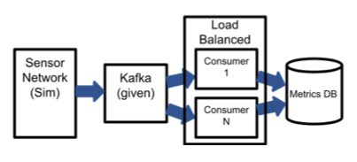
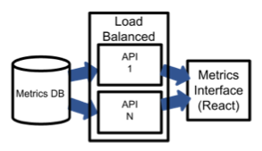

# Numina » Take-Home Project for Backend Software Engineer Candidates

### Hello Numina Team!

I spent a while initially just going over the project instructions, deliverables, and given code base. While I'm familiar with producer/consumer architecture, I've never used Kafka in a project before, so I read through some of the Kafka docs and python examples to begin with. I then ran the given system to make sure I had docker running and got a sense for the scale & rate of the sensor output.

Since this was a multi-component process, I knew I'd want to begin with a system design, before deciding on & designing a metrics database, and then develop iteratively through git.

#### System Design

After looking at some Kafka project examples, I began drawing out a simple system design for using consumers to feed & update a database as data flows in. On the other end of the database would sit a simple api which a web interface would call.

To keep it simple, I 'divided' my architecture into two primary sections- consuming the data and displaying. This not only kept my dev process simpler, but also gives me a few different components to work on in parallel in case I need to email a question.

After drawing them out on paper, I drew them in Google Docs. I apologize for the low quality screen shots, Google apparently removed the option to directly save a drawing as a png. I hope it's saving them millions.

##### Data consumption half

Scalability was the primary focus while designing the consumption portion of my backend. In practice, you'd want a client or user to be able to scale to N cameras (especially if you're selling the cameras), creating a higher max throughput for the system. This creates a need for a load balanced layer of stateless, robust consumer nodes that scale up during peak times and down to save resources during slow periods. This remains the same if deployed locally per-client or as a PaaS on a cloud service.

I'll dig into the database and modeling the data in a bit, but at this point all I know is I want a database that scales well and has great write throughput. It's also important that it already has a docker image and lots of docs/ support to reduce dev time.

Since setting up and deploying a load balanced cluster (probably kubernetes) seemed out of scope for this project, I wanted to set a realistic goal of developing a simple, stateless consumer image that I could manually deploy multiple of to verify their purpose. This consumer is generic and can process any type of record, regardless of sensor id or traveler type. While in a production setting I'd choose a faster language I know (Go or C++), Python will get the point across with it's simplicity and insane amount of documentation & examples. It's also nice that I have Docker to do the 'multiprocessing' for me and I won't have to deal with debugging any multithreaded Python code.

##### Display half

For this side of my data flow, I wanted to build something user-friendly & extendable to display my metrics, while staying within my limited frontend knowledge. I don't have much experience with creating dashboards with BI services, and they also wouldn't be as customizable as I may need. I decided on using React since I'm experienced with it and I can create exactly what I want to. It also helps that create-react-app is very quick to get up and running. Another advantage of React is that in a production cloud setting, you could run it on a CDN service and 'forget' about it from a backend perspective.

The dashboard itself will be very simple, with a distinct query area and display area. I'll then dockerize my react app and host that with the rest of the backend.

Very similarly to my Python consumers above, I'd need a scalable, secure middle layer between my database and React app for fetching data, preparing it to be graphed, and passing it to the frontend clients. This prevents clients from having direct access to the data while also helping database connections. In a production setting, this layer would need to be scaled, similar to above. Getting a load balanced layer with a k8s or Nginx layer once again seemed out of scope, so my goal here is to deploy a single flask image.

#### Database design

To begin picking a database, I worked my way backwards from the frontend to distinguish what data I needed exactly to display each type of metric. Since I needed counts to determine the average speed for a minute, and aggregating at the api layer is simpler than complex updates (from the consumers) to keep the database in a correct state, I knew I'd only need one row of data for min, max, total speed, and count for each sensor id+traveler type+minute. Since this data is very structured, I choose SQL to store these rows of data. Out of all SQL databases, I have the most experience with Postgres (which happens to also have tons of docs and bug help) making it an easy decision.

Calculating traveler speed requires storing prior information on each traveler id (x,y,time). This means that my consumers would be constantly connecting and checking these values, and writing over them each time a sensor reports a new position. This could severely limit my Postgres image's performance (or require high cloud costs), making it a potential choke point in my system. Even worse, this could in turn mess with my frontend's performance, and any other app that uses the API. Given the high write/read and low life-span of this data, I decided it would be best to extrapolate it out of the SQL schema and instead store this data in a Redis cache. This allows me to keep my original system design with stateless consumers and also keep short-lived data out of my structured metrics. This also meant I couldn't be updating/ checking Postgres with every record, unless I would be negating this effect.

After emailing Jackson, I discovered I should be calculating metrics on a rolling window, not set minutes. This requires the api to have access to all different travelers and the exact time each of them entered and left the sensor's range. This requires changing the SQL table to store a row per traveler, with their <sid,tid> as the primary key and storing their type, min, max, average, and entrance timestamp. Then, the api layer can pull only the data requested by the frontend (by sensor, type, & time frame). This would also allow me to keep more detailed info on each traveler in Redis (x,y, min, max, current average total, record count). This way, I can calculate the current speed and compare it to the max/min/average and only when those need updating, call my metrics DB.

#### Development

##### Consumer & DB nodes
One of my goals of the scalable consumer layer was to have less postgres calls than records. This means that every time a consumer processes a record, Postgres isn't neccassilry needed for calculation data, or to update. Using Redis to store a traveler object for intermediate calculations helps with this. Another issue I ran into with the consumers were reading the kafka stream correctly. While using the auto commit feature, I had multiple consumers trying to process and same record, resulting in Postgres bugs. After switching auto-commit off and committing offsets immediately after recieving the record, I got the consumers working again.

If I had 'unlimited' time, I'd upgrade these scripts to Go or C++ binaries to support the huge throughput required from the given simulator. I'd also accept batched records and process them together (where I could search for the same trav_id and calculate speed in one set of records). This combined with a dataloader approach (think GraphQL clients) could severly reduce database throughput via batching. I'd also want to store the last time the object is found my the sensor so that when I'm calculating minute windows, an object that takes multiple minutes to cross would be counted within each window. This would involve having to wait N seconds to make sure there's no more updates, or even creating some sore of model that does this for you. I'd also set up a full test kit and CI/CD methods, probably Github Actions if it was my call.

I wouldn't say I 'rushed' my database decision and design, but after seeing that the metrics could just be stored in one table, I may have not selected SQL in the first place. Something else I'd want to try out is a time-series DB like Influx or Prometheus, especially one that has it's own monitoring solution that I could use as the dashboard. Postgres does, however, have the ability to scale in a multi-master replication architecture, giving it a scalable write surface. I couldn't find a similar concept for a time-series DB online yet. I would also look into sharding the read data if the user interface became popular.

##### Api nodes
Once again, I'd upgrade these to a compiled language for the speed improvements. Since these api nodes pretty much do one thing, I think there's a lot of room for them to grow. First of all, I was planning on having the React frontend resend a query every 60 seconds for a "real-time" feel, but this could also be accomplished via websocket updates. Another huge upgrade for this layer would be a cache that stores all of the calculated time windows for certain querys, and can actually combine cached results to quickly return a query, even if that query hasn't been explicity requested yet. I'm sure I could also optimize the code that queries postgres and calculates the time windows.

In production, I'd have this layer sitting behind an Nginx proxy that routes to a Kubernetes load balancer, then routing across all active nodes in the layer. I'd also set up a full test kit and CI/CD methods, probably Github Actions again.

##### Display
I ran out of time to code up a solid display, but all I had planned out was a simple form that asked for sensor_id (or all), traveler_type (or all), and start/end times (or all) from my backend api nodes, before filling in excluded time windows with 0s and rendering a react-vis chart for each metric (speed & count) over time.

In production, I'd either put this one AWS Amplify & password protect the site, or leave it password-less on an organization's VPN, being served from a simple file server container within the backend system.

### Wrap up
Working with Kafka for the first time was a lot less challenging than I thought. After reading up on the offset-commit system, I was able to push through the only real bug I had with Kafka throughout the process. Running it on docker compose is also very easy and has pretty quick dev cycles. Although I tried to focus my system on speed and scalability, I think if deployed correctly it could be very secure, with the only ingress points being Nginx and Kafka.

Although I didn't finish up what I had planned with my API and frontend display, I think the code and notes I have clearly show the path I want to take and how I'd complete the project with CI, CD, deployment code, monitoring and more. 
